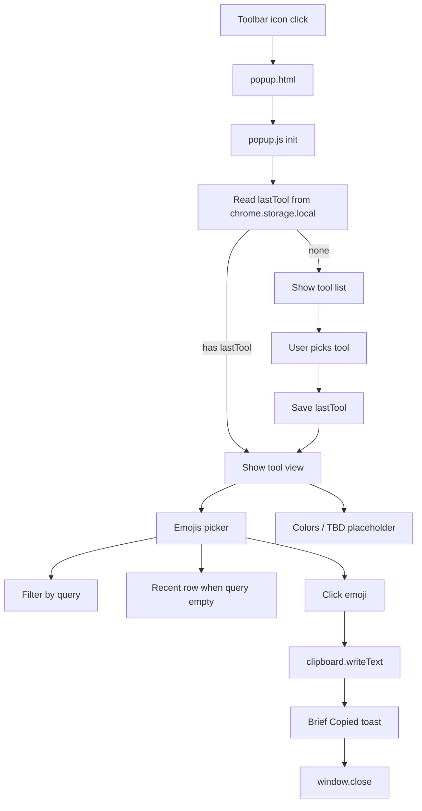

# dtp-os popup tools and emoji picker

## Current state

- Extension is still branded **buildspace os** in [`manifest.json`](manifest.json) and [`tab_override.html`](tab_override.html).
- No `action` / popup exists — clicking the toolbar icon does nothing.
- New tab wallpaper/embed flow is unchanged and stays as-is.
- Wishlist already describes emoji + color tools in [`docs/wishlist.md`](docs/wishlist.md).

## Goals

1. Rebrand manifest (and related titles) to **dtp-os**.
2. Add standard MV3 toolbar popup via `action.default_popup`.
3. Tool launcher: **Emojis**, **Colors**, **TBD** (Colors/TBD are stubs for now).
4. On popup open, **auto-navigate to last-used tool** if one exists.
5. **Emojis tool**: search bar, recent row, scrollable emoji grid, filter-on-search, click → copy + brief toast → close popup.

## Architecture



## File changes

### 1. Manifest rebrand + popup action

Update [`manifest.json`](manifest.json):

```json
{
  "name": "dtp-os",
  "description": "dtp-os — new tab home and browser tools",
  "action": {
    "default_popup": "popup.html",
    "default_title": "dtp-os",
    "default_icon": {
      "48": "assets/48.png",
      "128": "assets/128.png"
    }
  }
}
```

Also update `<title>` in [`tab_override.html`](tab_override.html) to `dtp-os`. No new permissions needed — `storage` is already granted; `navigator.clipboard.writeText` works inside extension popups.

### 2. New popup shell

| File | Purpose |
|------|---------|
| [`popup.html`](popup.html) | Popup document: tool list view + tool panel container |
| [`css/popup.css`](css/popup.css) | Compact dark UI matching existing hot-pink accent from [`css/newtab.css`](css/newtab.css) |
| [`js/popup.js`](js/popup.js) | Router: list ↔ tool views, last-tool restore, back navigation |
| [`js/toolSettings.js`](js/toolSettings.js) | `chrome.storage.local` helpers (mirrors pattern in [`js/wallpapers.js`](js/wallpapers.js)) |
| [`js/emojis.js`](js/emojis.js) | Emoji picker UI + search/filter/recents + copy flow |
| [`js/emoji-data.js`](js/emoji-data.js) | Static curated emoji list with search keywords |

**Popup layout (two views, one DOM):**

- **Tool list** — header “dtp-os”, three rows: Emojis (active), Colors (disabled/“Soon”), TBD (disabled/“Soon”).
- **Tool panel** — back button + tool content. Emojis panel contains:
  1. Search input (autofocus)
  2. **Recent row** — horizontal strip of last ~12 unique emojis (hidden while search query is non-empty)
  3. **Emoji grid** — all emojis when query empty; filtered subset when searching

Stub tools show a short “Coming soon” message instead of navigating away from the panel.

### 3. Storage schema (`chrome.storage.local`)

| Key | Type | Default | Notes |
|-----|------|---------|-------|
| `lastTool` | `"emojis" \| "colors" \| "tbd" \| null` | `null` | Set when user opens a tool; read on popup init |
| `recentEmojis` | `string[]` | `[]` | Emoji characters, most-recent-first, max 12, dedupe on insert |

Add to [`js/toolSettings.js`](js/toolSettings.js):

```js
export const TOOLS = {
  EMOJIS: "emojis",
  COLORS: "colors",
  TBD: "tbd",
};

export async function getLastTool() { /* ... */ }
export async function setLastTool(id) { /* ... */ }
export async function getRecentEmojis() { /* ... */ }
export async function recordEmojiUse(emoji) { /* prepend, dedupe, cap at 12 */ }
```

### 4. Emoji data and search

[`js/emoji-data.js`](js/emoji-data.js) — ship a **curated static list** (~300–400 common emojis) to avoid bundlers and network calls:

```js
export const EMOJI_LIST = [
  { emoji: "😀", keywords: ["grinning", "face", "smile", "happy"] },
  // ...
];
```

Search logic in [`js/emojis.js`](js/emojis.js):
- Normalize query: lowercase, trim.
- Match if any keyword includes the query **or** emoji character includes query (supports pasting an emoji to find it).
- When `query.length > 0`: hide recent row, render **only** filtered results (empty state: “No emojis found”).
- When query cleared: restore recent row + full grid.

### 5. Emoji click behavior (per your choice)

On emoji button click:
1. `await navigator.clipboard.writeText(emoji)`
2. `await recordEmojiUse(emoji)` and `await setLastTool("emojis")`
3. Show inline toast (“Copied!”) for ~400ms
4. `window.close()`

If clipboard fails, show error toast and keep popup open.

### 6. Popup UX details

- Size: ~360px wide, max-height ~480px with scroll on emoji grid.
- Back button on tool panel returns to tool list (does not clear `lastTool` — last tool is only updated when a tool is entered).
- First launch (no `lastTool`): show tool list.
- Returning user: popup opens directly into Emojis (or last stub if we ever implement Colors — stubs won’t auto-open until implemented).
- Keyboard: Escape on tool panel goes back to list; search input stays focused on Emojis open.

### 7. Docs

Update [`docs/architecture.md`](docs/architecture.md):
- Add popup + tool modules to repo layout diagram.
- Document `action.default_popup`, storage keys, and popup vs new-tab separation.

Optionally tick emoji wishlist item in [`docs/wishlist.md`](docs/wishlist.md).

## Out of scope (this pass)

- Colors tool implementation (stub only)
- TBD tool definition (stub only)
- Content-script emoji insertion into active page
- Automated tests (repo has none today)

## Manual test plan

1. Reload unpacked extension in Chrome.
2. Confirm Extensions page shows **dtp-os** name/description.
3. Click toolbar icon → popup opens.
4. First visit: tool list visible; Emojis opens picker; Colors/TBD show “Coming soon”.
5. Emojis: search filters grid; recent row hides during search; clearing search restores recents + full list.
6. Click emoji → “Copied!” toast → popup closes; paste elsewhere confirms clipboard.
7. Reopen popup → lands directly on Emojis (last tool).
8. Back button returns to tool list.
9. New tab page still works (embed/wallpaper unchanged).
