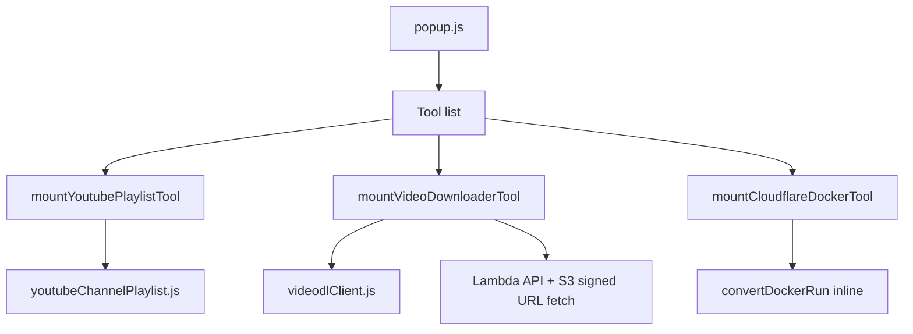

# Add waifuDOTbond tools to dtp-os popup

## Context

[dtp-os](file:///Users/argo/Code/dtp/dtp-os) already has a popup tool shell ([`popup.js`](file:///Users/argo/Code/dtp/dtp-os/js/popup.js), [`toolSettings.js`](file:///Users/argo/Code/dtp/dtp-os/js/toolSettings.js)) with **Emojis** implemented via `mountEmojisTool()`. [waifuDOTbond](file:///Users/argo/Code/atos/waifuDOTbond) registers the three target tools in [`src/lib/toolsRegistry.js`](file:///Users/argo/Code/atos/waifuDOTbond/src/lib/toolsRegistry.js):

| waifu tool | Logic | UI complexity |
|------------|-------|----------------|
| YouTube Uploads Playlist | [`youtubeChannelPlaylist.js`](file:///Users/argo/Code/atos/waifuDOTbond/src/lib/youtubeChannelPlaylist.js) — client-only | Textarea + live output + copy + help |
| Video Downloader | [`videodlClient.js`](file:///Users/argo/Code/atos/waifuDOTbond/src/lib/videodlClient.js) + Lambda API | URL input, format toggle, progress, blob download |
| Cloudflare Docker | Inline in [`CloudflareDockerConverter.js`](file:///Users/argo/Code/atos/waifuDOTbond/src/components/CloudflareDockerConverter.js) | Textarea + live output + copy |

**Approach:** Do not add React or a bundler. Copy portable libs into `js/lib/`, implement three `mount*Tool(container, ctx)` modules matching the [`emojis.js`](file:///Users/argo/Code/dtp/dtp-os/js/emojis.js) pattern, and wire them in `popup.js`. Video API: **same sway-sls Lambda** as waifu (`https://xvbc38vi4h.execute-api.us-east-2.amazonaws.com`).



## Tool list changes

Update [`TOOL_DEFINITIONS`](file:///Users/argo/Code/dtp/dtp-os/js/popup.js) and [`TOOLS`](file:///Users/argo/Code/dtp/dtp-os/js/toolSettings.js):

| id | Label | implemented |
|----|-------|-------------|
| `emojis` | Emojis | yes (existing) |
| `youtube-playlist` | YouTube Playlist | yes |
| `video-downloader` | Video Downloader | yes |
| `cloudflare-docker` | Cloudflare Docker | yes |
| `colors` | Colors | no (keep “Soon” stub) |

Remove placeholder **`tbd`** (replaced by real tools). Extend `IMPLEMENTED_TOOLS` to include all four active tools.

## New / updated files

### 1. Shared libs (copy from waifu, minimal edits)

| File | Source |
|------|--------|
| [`js/lib/youtubeChannelPlaylist.js`](file:///Users/argo/Code/dtp/dtp-os/js/lib/youtubeChannelPlaylist.js) | [`waifuDOTbond/src/lib/youtubeChannelPlaylist.js`](file:///Users/argo/Code/atos/waifuDOTbond/src/lib/youtubeChannelPlaylist.js) — verbatim |
| [`js/lib/videodlClient.js`](file:///Users/argo/Code/dtp/dtp-os/js/lib/videodlClient.js) | [`waifuDOTbond/src/lib/videodlClient.js`](file:///Users/argo/Code/atos/waifuDOTbond/src/lib/videodlClient.js) — drop Node-only branch in `downloadVideoAsync` (extension popup is always browser) |
| [`js/lib/config.js`](file:///Users/argo/Code/dtp/dtp-os/js/lib/config.js) | Export `VIDEO_DL_API_URL` defaulting to waifu’s execute-api URL (no `process.env` in extension) |

### 2. Tool UI modules

Each exports `mountXTool(container, { showToast, hideToast })` returning an optional cleanup function (remove listeners), and calls `setLastTool(...)` on meaningful interaction (same as emojis).

**[`js/youtubePlaylist.js`](file:///Users/argo/Code/dtp/dtp-os/js/youtubePlaylist.js)** — port [`YouTubeChannelPlaylist.js`](file:///Users/argo/Code/atos/waifuDOTbond/src/components/YouTubeChannelPlaylist.js):
- Collapsible help panel (`?` button)
- Textarea `input` event → `buildUploadsPlaylistFromInput`
- Read-only channel ID + playlist URL fields
- Copy playlist URL + “Open in YouTube” link (`target="_blank"`)

**[`js/cloudflareDocker.js`](file:///Users/argo/Code/dtp/dtp-os/js/cloudflareDocker.js)** — port converter logic from [`CloudflareDockerConverter.js`](file:///Users/argo/Code/atos/waifuDOTbond/src/components/CloudflareDockerConverter.js):
- `convertCommand()` (insert `-d --restart unless-stopped` after `docker run`)
- Live output textarea + copy button + inline errors

**[`js/videoDownloader.js`](file:///Users/argo/Code/dtp/dtp-os/js/videoDownloader.js)** — port core flow from [`VideoDownloader.js`](file:///Users/argo/Code/atos/waifuDOTbond/src/components/VideoDownloader.js):
- URL input, platform badge, MP4/MP3 toggle, download button
- `downloadVideoAsync(url, true, onProgress, format)` with progress bar + status labels (reuse `PROGRESS_BY_STATUS` / `STATUS_LABELS` constants)
- After job completes: `fetch(downloadUrl)` → blob → anchor download (same as waifu); fallback to direct anchor if fetch fails
- **Do not** `window.close()` on success (unlike emojis) — downloads can take minutes
- Compact layout: omit or collapse “Supported Platforms” footer to save popup height

### 3. Router and styles

**[`js/popup.js`](file:///Users/argo/Code/dtp/dtp-os/js/popup.js)**
- Import three mount functions
- Track cleanup refs per tool (like `emojiCleanup`)
- In `showToolPanel`, dispatch to the correct `mount*Tool`
- Generalize cleanup on back navigation

**[`css/popup.css`](file:///Users/argo/Code/dtp/dtp-os/css/popup.css)**
- Add shared `.tool-form-panel` with `overflow-y: auto` on panel content (video + playlist need scroll within 480px max height)
- Form primitives: `.tool-label`, `.tool-textarea`, `.tool-input`, `.tool-output`, `.tool-btn`, `.tool-error`, `.tool-progress`, `.tool-help` — hot-pink accent consistent with existing popup

### 4. Manifest permissions

Update [`manifest.json`](file:///Users/argo/Code/dtp/dtp-os/manifest.json):

```json
"host_permissions": [
  "https://xvbc38vi4h.execute-api.us-east-2.amazonaws.com/*",
  "https://*.amazonaws.com/*"
]
```

Required for Lambda `fetch` and signed S3 download URLs. Document expanded security surface in [`docs/architecture.md`](file:///Users/argo/Code/dtp/dtp-os/docs/architecture.md) (popup section + permissions table).

No new npm dependencies; no TypeScript.

### 5. Docs / wishlist

- Update [`docs/architecture.md`](file:///Users/argo/Code/dtp/dtp-os/docs/architecture.md): repo layout (`js/lib/*`, three tool modules), `lastTool` enum, host permissions rationale
- Check off the three waifu tools line in [`docs/wishlist.md`](file:///Users/argo/Code/dtp/dtp-os/docs/wishlist.md)

## Out of scope

- Colors tool implementation
- Configurable API URL UI (hardcode waifu default; can add storage override later)
- Sharing code via a monorepo package between waifu and dtp-os
- Automated tests (repo has none today)

## Manual test plan

1. Reload unpacked extension.
2. Popup tool list shows 5 rows; four openable, Colors disabled with “Soon”.
3. **YouTube Playlist:** paste page source with `"channelId":"UC..."` → playlist URL appears; copy works; Open link works.
4. **Cloudflare Docker:** paste `docker run cloudflare/...` → output includes `-d --restart unless-stopped`; copy works; invalid input shows error.
5. **Video Downloader:** paste a short public YouTube/TikTok URL → progress updates → file saves (or anchor fallback); errors surface in panel.
6. Reopen popup → restores last-used tool.
7. Back button returns to list; Escape still works.
8. New tab page unchanged.
