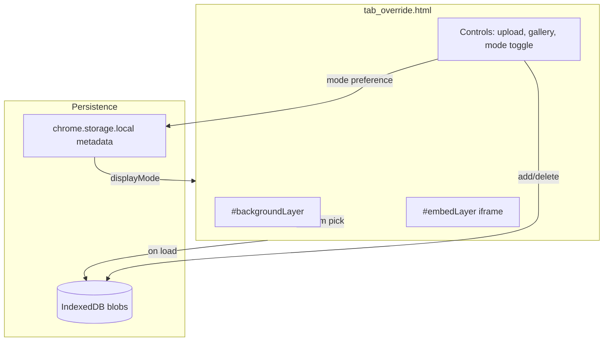

# Wallpaper backgrounds for dtp-os

## Goals

- Users can **upload** background images (JPEG/PNG/WebP), **persist** them locally, and **delete** them from a simple gallery.
- **Display modes** (user choice, persisted):
  - **Wallpaper mode** — full-viewport photo; no iframe.
  - **Embed mode** — current behavior (`https://buildspace.so/home` iframe, black fallback).
- **Shuffle on new tab** — each time [`tab_override.html`](/Users/argo/Code/dtp/dtp-os/tab_override.html) loads, pick a **random** image from the saved set (if any); if none, wallpaper mode shows the existing black default.

## Architecture



| Layer | Technology | Stores |
|-------|------------|--------|
| Image bytes | **IndexedDB** (`dtp-os`, store `wallpapers`) | `{ id, blob, mimeType, addedAt }` |
| Preferences + index | **`chrome.storage.local`** | `{ displayMode, wallpaperOrder: string[] }` |

**Why IndexedDB:** `chrome.storage.local` is ~10MB total and unsuitable for multiple photos. IndexedDB handles blobs cleanly in extension pages without new permissions beyond `storage`.

**Why not the service worker:** Upload and preview run on the new-tab document; keep [`background.js`](/Users/argo/Code/dtp/dtp-os/background.js) unchanged except optional future messaging—no change required for v1.

## UI / DOM changes

Refactor [`tab_override.html`](/Users/argo/Code/dtp/dtp-os/tab_override.html) into a small shell:

```html
<div id="backgroundLayer" aria-hidden="true"></div>
<div id="embedLayer" class="container">…iframe…</div>
<aside id="controls" class="controls">…</aside>
```

- **`#backgroundLayer`** — `background-size: cover; background-position: center;` fed by `URL.createObjectURL(blob)` on load.
- **`#embedLayer`** — shown only when `displayMode === 'embed'`.
- **`#controls`** — collapsed by default; expand via gear icon:
  - File input (`accept="image/*"`, `multiple`)
  - Thumbnail grid with per-image **Delete**
  - **Mode toggle**: Wallpaper / Embedded site
  - Optional: image count + “random on each new tab” hint (no extra setting needed per your choice)

Styling in new [`css/newtab.css`](/Users/argo/Code/dtp/dtp-os/css/newtab.css) (Netflix-style dark panel, hot-pink accents per DTP preference where it fits this tiny extension).

## JavaScript modules (vanilla, no bundler)

| File | Responsibility |
|------|----------------|
| [`js/storage.js`](/Users/argo/Code/dtp/dtp-os/js/storage.js) | IndexedDB open/migrate; `getAll`, `getById`, `put`, `delete` |
| [`js/wallpapers.js`](/Users/argo/Code/dtp/dtp-os/js/wallpapers.js) | Sync `wallpaperOrder` with IDB; `pickRandomId()`; upload handler (validate type/size, generate `crypto.randomUUID()`) |
| [`js/newtab.js`](/Users/argo/Code/dtp/dtp-os/js/newtab.js) | Wire UI, apply mode, load random wallpaper on init, revoke old object URLs on change |

**Upload validation (v1):**

- Allowed MIME: `image/jpeg`, `image/png`, `image/webp`
- Max size per file: **5 MB** (user-facing error if exceeded)
- Cap: **50 images** (prevent runaway disk use; document in docs)

**New-tab shuffle logic** ([`js/newtab.js`](/Users/argo/Code/dtp/dtp-os/js/newtab.js)):

```js
// On DOMContentLoaded
const mode = await getDisplayMode();
applyMode(mode);
if (mode === 'wallpaper') {
  const id = await pickRandomWallpaperId(); // uniform random from wallpaperOrder
  if (id) await setBackgroundFromId(id);
}
```

Embed mode: skip background selection; iframe visible as today.

**Memory:** Keep one active `objectURL` per tab; `URL.revokeObjectURL` before assigning the next.

## Manifest updates

[`manifest.json`](/Users/argo/Code/dtp/dtp-os/manifest.json):

```json
"permissions": ["tabs", "storage"]
```

No `host_permissions` needed. Scripts loaded from extension paths in `tab_override.html`:

```html
<script type="module" src="js/newtab.js"></script>
```

(Use ES modules so `storage.js` / `wallpapers.js` import cleanly.)

## File tree after change

```
dtp-os/
├── manifest.json          # +storage permission
├── tab_override.html      # new DOM + module script
├── css/newtab.css
├── js/
│   ├── storage.js
│   ├── wallpapers.js
│   └── newtab.js
├── background.js          # unchanged
└── docs/
    ├── architecture.md    # add wallpapers section + diagram
    └── wallpapers.md      # user-facing feature doc (upload, modes, limits)
```

## Documentation

- Update [`docs/architecture.md`](/Users/argo/Code/dtp/dtp-os/docs/architecture.md): persistence split, mode toggle flow, storage limits.
- Add [`docs/wallpapers.md`](/Users/argo/Code/dtp/dtp-os/docs/wallpapers.md): how to upload, toggle modes, shuffle behavior, quotas.

## Manual test plan

1. Load unpacked extension; open new tab → embed mode unchanged.
2. Upload 2+ images; switch to wallpaper mode → random image fills viewport.
3. Open several new tabs → backgrounds vary (statistically).
4. Delete an image from gallery → no longer appears on new tabs.
5. Toggle back to embed mode → iframe returns; backgrounds not shown.
6. Reload extension → images and mode persist.
7. Opera/shared-start path still lands on same `tab_override.html` (background feature works there too).

## Out of scope (v1)

- Auto-rotate timer while tab stays open
- Cloud sync / export
- Image compression or cropping UI
- Rebranding manifest from “buildspace os” (unless you ask in a follow-up)

## Risk / limitation

- **Embed mode** hides wallpapers by design (full iframe). Users must switch to **Wallpaper mode** to see uploads—matches your “both toggle” choice.
- Very large libraries may slow gallery render; 50-image cap mitigates this.
