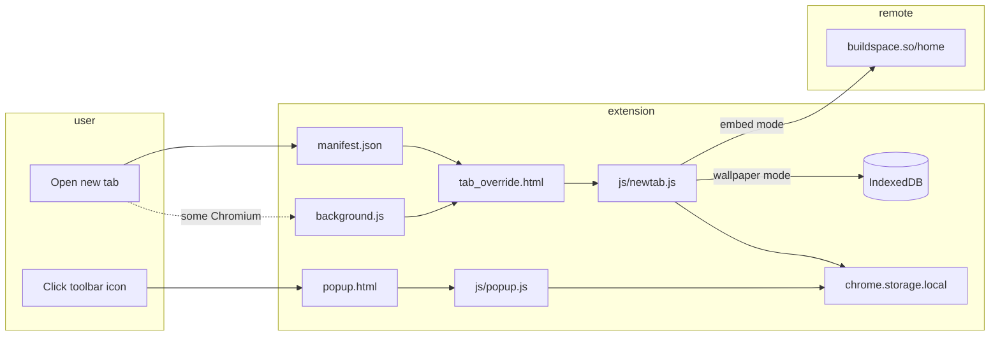

# dtp-os architecture

dtp-os is a **Manifest V3 browser extension** that replaces the browser’s default new tab page with a full-viewport page embedding an external web app. The repo lives under [oscoDOTblog/dtp-os](https://github.com/oscoDOTblog/dtp-os) and is derived from [buildspace/buildspace-os](https://github.com/buildspace/buildspace-os), with a background-script fix for Opera and other Chromium browsers that use a shared start page URL.

End-user install steps remain in the root [README.md](../README.md). This document describes how the extension works internally and how to customize or maintain it.

## High-level flow



| User action | What runs | Result |
|-------------|-----------|--------|
| Open a new tab (typical Chrome/Edge) | `tab_override.html` + `js/newtab.js` | Embed or wallpaper UI per saved `displayMode` |
| Click toolbar icon | `popup.html` + `js/popup.js` | Tool launcher list; pick a tool to open its panel |
| Wallpaper mode, images saved | `pickRandomWallpaperId()` on load | Random full-viewport background |
| New tab via shared start page (`chrome://startpageshared/…`) | `background.js` listens and redirects | Same `tab_override.html` experience |

User guide for wallpapers: [wallpapers.md](./wallpapers.md).

## Repository layout

```
dtp-os/
├── manifest.json       # Extension metadata, permissions, new-tab override, toolbar popup
├── background.js       # Service worker: shared-start-page redirect
├── popup.html          # Toolbar popup shell (tool launcher + tool panels)
├── tab_override.html   # New tab shell (layers + controls)
├── css/
│   ├── newtab.css      # New tab layout and settings panel
│   └── popup.css       # Toolbar popup layout and tools
├── js/
│   ├── lib/
│   │   ├── config.js                 # VIDEO_DL_API_URL (sway-sls Lambda)
│   │   ├── videodlClient.js          # Async video download API client
│   │   └── youtubeChannelPlaylist.js # UC → UU playlist URL logic
│   ├── storage.js           # IndexedDB wallpaper blobs
│   ├── wallpapers.js        # CRUD, validation, mode + order in chrome.storage
│   ├── appSettings.js       # App name + custom greetings in chrome.storage
│   ├── defaultGreetings.js  # Built-in rotating new-tab messages
│   ├── settingsTool.js      # Settings / branding UI for popup and new tab
│   ├── newtab.js            # UI wiring, random background on load
│   ├── popup.js             # Popup router: tool list and navigation
│   ├── toolSettings.js      # Shared tool id constants
│   ├── emojis.js            # Emoji picker UI, search, copy-to-clipboard
│   ├── emoji-data.js        # Static curated emoji list with search keywords
│   ├── youtubePlaylist.js   # YouTube uploads playlist tool
│   ├── videoDownloader.js   # Video downloader tool (Lambda + S3 fetch)
│   └── cloudflareDocker.js  # Cloudflare docker run converter tool
├── assets/             # Extension icons (48, 128) and legacy logo
├── docs/               # Technical documentation
└── README.md           # End-user setup (load unpacked, developer mode)
```

There is no build step, bundler, or package manager. The extension is loaded **as-is** via “Load unpacked” in the browser.

## Components

### `manifest.json`

- **Manifest version**: 3 (service worker background, no persistent background page).
- **Permissions**: `tabs` (service worker tab redirect) and `storage` (display mode and wallpaper index).
- **Host permissions**: sway-sls video-download API Gateway and `*.amazonaws.com` for signed S3 download URLs (video downloader tool only).
- **New tab override**: `chrome_url_overrides.newtab` points at `tab_override.html`, which is the primary mechanism for replacing the new tab page.
- **Toolbar action**: `action.default_popup` points at `popup.html` for the browser-tools launcher.
- **Icons**: `assets/48.png` and `assets/128.png` for the extension listing and toolbar.

Display name and description are branded **dtp-os**.

### `tab_override.html`, `css/newtab.css`, `js/newtab.js`

The new tab page has three layers:

1. **`#backgroundLayer`** — cover-style background image (wallpaper mode).
2. **`#embedLayer`** — full-viewport `<iframe>` to `https://buildspace.so/home` (embed mode, default).
3. **`#controls`** — gear-toggle panel for upload, gallery, delete, and mode switch.

`js/newtab.js` runs on each new tab load: reads `displayMode` from `chrome.storage.local`, shows the correct layer, and in wallpaper mode calls `pickRandomWallpaperId()` then loads the blob from IndexedDB via `URL.createObjectURL`.

To point the embed at a different home, change the iframe `src` in `tab_override.html`.

### `popup.html`, `css/popup.css`, `js/popup.js`, tool modules

Clicking the toolbar icon opens a compact popup separate from the new tab page.

1. **Tool list** — Always shown when the popup opens. Emojis, YouTube Playlist, Video Downloader, and Cloudflare Docker (implemented); Colors (stub marked “Soon”).
2. **Emojis picker** — Search bar and scrollable emoji grid with client-side filter. Clicking an emoji copies it to the clipboard, shows a brief toast, then closes the popup.
3. **YouTube Playlist** — Paste channel page source, URL, or `UC...` ID; live-builds uploads playlist URL (`UC` → `UU`); copy and open in YouTube. Client-only (`js/lib/youtubeChannelPlaylist.js`).
4. **Video Downloader** — Paste a social URL; polls sway-sls Lambda (`js/lib/videodlClient.js`), then fetches the signed file and triggers a browser download.
5. **Cloudflare Docker** — Paste `docker run ...`; inserts `-d --restart unless-stopped` after `docker run`; copy converted command.

Each tool exports a `mount*Tool(container, { showToast, hideToast })` function; `js/popup.js` routes by tool id and runs cleanup when navigating back.

`js/toolSettings.js` exports shared tool id constants. `js/emoji-data.js` ships a static curated emoji list (~1,300 entries) with keyword tags for client-side search.

### `js/storage.js` and `js/wallpapers.js`

| Store | Key / shape | Contents |
|-------|-------------|----------|
| IndexedDB `dtp-os` / `wallpapers` | `id` | `{ id, blob, mimeType, addedAt }` |
| `chrome.storage.local` | `displayMode` | `"embed"` \| `"wallpaper"` |
| `chrome.storage.local` | `wallpaperOrder` | `string[]` of IDs (gallery order) |

Upload rules: JPEG/PNG/WebP, max 5 MB per file, max 50 images. `syncWallpaperOrderWithDatabase()` reconciles the order array with IndexedDB on load.

### `background.js` (service worker)

Handles Chromium variants that initially open `chrome://startpageshared/` instead of going straight to the overridden new tab document.

1. On `chrome.tabs.onCreated`, if the new tab has **no URL yet** (`!tab.url`), register a one-shot-style handler on `chrome.tabs.onUpdated`.
2. When that tab’s URL updates, if it starts with `chrome://startpageshared/`, call `chrome.tabs.update(tab.id, { url: "tab_override.html" })`.

This logic was added to support **Opera and other Chromium browsers** (see commit `ba90754` in history). Standard Chrome new-tab override usually does not need this path but keeping it avoids a blank or wrong start page on those browsers.

**Implementation note for maintainers**: `onUpdated` listeners are registered inside `onCreated` without removal. Under heavy tab creation, duplicate listeners could accumulate. If that becomes an issue, refactor to a single global `onUpdated` handler that tracks pending tab IDs, or use `{ once: true }` patterns where the API allows.

## Permissions and security model

| Permission | Why |
|------------|-----|
| `tabs` | Read tab URL on create/update; redirect shared start page tabs to `tab_override.html` |
| `storage` | Persist `displayMode` and `wallpaperOrder` (image bytes live in IndexedDB, not storage quota) |
| `host_permissions` (API Gateway + `*.amazonaws.com`) | Video Downloader: start/poll Lambda jobs and fetch signed S3 download URLs |

The extension does **not** request `scripting` or broad `<all_urls>` access. It does not inject content scripts into arbitrary pages. Risk surface includes: embedded iframe content, tab URL inspection in the service worker, locally stored user images in IndexedDB, clipboard writes from popup tools (user-initiated), and outbound `fetch` to the video-download API when the user starts a download.

Users must **keep** the extension’s new-tab override when prompted (“page was changed by … extension”); declining disables the override.

## Browser support

| Environment | Notes |
|-------------|--------|
| Chrome / Edge (Chromium) | Documented in README; `chrome_url_overrides` + optional shared-start redirect |
| Opera / other Chromium | Relies on `background.js` redirect from `chrome://startpageshared/` |
| Firefox | Uses different extension APIs; this manifest is Chrome-oriented and is not validated for Firefox |

## Customization checklist

1. **Home URL** — Edit iframe `src` in `tab_override.html`.
2. **Branding** — Set app name and optional custom greetings (JSON array) via the center **Settings** modal on the new tab (gear icon) or **Settings** in the toolbar popup. Empty greetings use 105 built-in rotating messages. Update `name`, `description`, and icons in `manifest.json` for the extension listing itself.
3. **Styling** — Edit `css/newtab.css` (background layer, controls panel).
4. **Shared start page** — If a browser uses a different internal URL prefix, extend the `startsWith(...)` check in `background.js`.

## Testing locally

1. Enable **Developer mode** in the browser’s Extensions page.
2. **Load unpacked** and select the `dtp-os` directory (folder must contain `manifest.json`).
3. Open a **new tab** and confirm the prompt to keep the extension’s new tab page.
4. Click the **toolbar icon** and confirm the popup opens to the tool list every time.
5. On Opera or a browser that uses the shared start page, confirm redirect to the iframe page (watch service worker logs in the extension’s “Inspect views: service worker” if needed).

There are no automated tests in this repo.

## Relationship to DTP

The **dtp** parent folder also contains projects such as `dtp-videodl` (desktop/web tooling). **dtp-os** is separate: a lightweight browser shell for a fixed “home” URL on every new tab, not a Node/Python app. Renaming or repointing the embedded URL is the main way to align this extension with DTP or osco branding without changing extension architecture.

## References

- [Chrome extension manifest — `chrome_url_overrides`](https://developer.chrome.com/docs/extensions/reference/manifest/chrome-url-overrides)
- [Manifest V3 service workers](https://developer.chrome.com/docs/extensions/mv3/service_workers/)
- Upstream user guide: [buildspace-os README](https://github.com/buildspace/buildspace-os)
